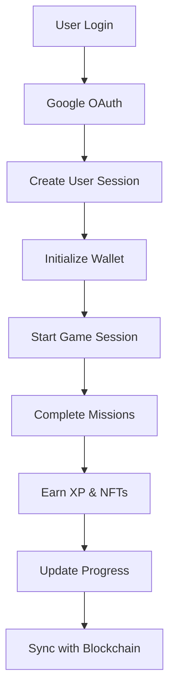

# 🏗️ Technical Architecture / Arquitetura Técnica

## 🇧🇷 **Português**

### 📋 **Visão Geral da Arquitetura**

O **Nhangara Mirim** utiliza uma arquitetura moderna e escalável, combinando tecnologias de ponta para criar uma experiência de jogo imersiva e educativa.

### 🏛️ **Arquitetura em Camadas**

```
┌─────────────────────────────────────────────────────────────┐
│                    Presentation Layer                      │
│  ┌─────────────┐  ┌─────────────┐  ┌─────────────┐      │
│  │   React 19  │  │ TypeScript  │  │ TailwindCSS │      │
│  └─────────────┘  └─────────────┘  └─────────────┘      │
└─────────────────────────────────────────────────────────────┘
┌─────────────────────────────────────────────────────────────┐
│                    Business Logic Layer                    │
│  ┌─────────────┐  ┌─────────────┐  ┌─────────────┐      │
│  │   Services  │  │   Contexts  │  │    Hooks    │      │
│  └─────────────┘  └─────────────┘  └─────────────┘      │
└─────────────────────────────────────────────────────────────┘
┌─────────────────────────────────────────────────────────────┐
│                    Data Layer                             │
│  ┌─────────────┐  ┌─────────────┐  ┌─────────────┐      │
│  │ Cloudflare  │  │   Hedera    │  │ LocalStorage│      │
│  │     D1      │  │ Hashgraph   │  │             │      │
│  └─────────────┘  └─────────────┘  └─────────────┘      │
└─────────────────────────────────────────────────────────────┘
```

### 🔧 **Componentes Técnicos**

#### **Frontend (React 19 + TypeScript)**
- **Framework**: React 19 com TypeScript
- **Build Tool**: Vite para desenvolvimento rápido
- **Styling**: Tailwind CSS para design responsivo
- **State Management**: React Context API
- **Routing**: React Router DOM

#### **Backend (Cloudflare Workers)**
- **Runtime**: Cloudflare Workers (V8 isolates)
- **Database**: Cloudflare D1 (SQLite)
- **Storage**: Cloudflare KV (Key-Value)
- **CDN**: Cloudflare Edge Network

#### **Blockchain (Hedera Hashgraph)**
- **Network**: Hedera Mainnet
- **Tokens**: HBAR e NFTs customizados
- **SDK**: @hashgraph/sdk
- **Consensus**: aBFT (asynchronous Byzantine Fault Tolerance)

### 📊 **Fluxo de Dados**



---

## 🇺🇸 **English**

### 📋 **Architecture Overview**

**Nhangara Mirim** uses a modern and scalable architecture, combining cutting-edge technologies to create an immersive and educational gaming experience.

### 🏛️ **Layered Architecture**

```
┌─────────────────────────────────────────────────────────────┐
│                    Presentation Layer                      │
│  ┌─────────────┐  ┌─────────────┐  ┌─────────────┐      │
│  │   React 19  │  │ TypeScript  │  │ TailwindCSS │      │
│  └─────────────┘  └─────────────┘  └─────────────┘      │
└─────────────────────────────────────────────────────────────┘
┌─────────────────────────────────────────────────────────────┐
│                    Business Logic Layer                    │
│  ┌─────────────┐  ┌─────────────┐  ┌─────────────┐      │
│  │   Services  │  │   Contexts  │  │    Hooks    │      │
│  └─────────────┘  └─────────────┘  └─────────────┘      │
└─────────────────────────────────────────────────────────────┘
┌─────────────────────────────────────────────────────────────┐
│                    Data Layer                             │
│  ┌─────────────┐  ┌─────────────┐  ┌─────────────┐      │
│  │ Cloudflare  │  │   Hedera    │  │ LocalStorage│      │
│  │     D1      │  │ Hashgraph   │  │             │      │
│  └─────────────┘  └─────────────┘  └─────────────┘      │
└─────────────────────────────────────────────────────────────┘
```

### 🔧 **Technical Components**

#### **Frontend (React 19 + TypeScript)**
- **Framework**: React 19 with TypeScript
- **Build Tool**: Vite for fast development
- **Styling**: Tailwind CSS for responsive design
- **State Management**: React Context API
- **Routing**: React Router DOM

#### **Backend (Cloudflare Workers)**
- **Runtime**: Cloudflare Workers (V8 isolates)
- **Database**: Cloudflare D1 (SQLite)
- **Storage**: Cloudflare KV (Key-Value)
- **CDN**: Cloudflare Edge Network

#### **Blockchain (Hedera Hashgraph)**
- **Network**: Hedera Mainnet
- **Tokens**: HBAR and custom NFTs
- **SDK**: @hashgraph/sdk
- **Consensus**: aBFT (asynchronous Byzantine Fault Tolerance)

### 📊 **Data Flow**


---

## 🗄️ **Database Schema / Esquema do Banco**

### **Users Table**
```sql
CREATE TABLE users (
    id TEXT PRIMARY KEY,
    email TEXT UNIQUE NOT NULL,
    name TEXT NOT NULL,
    picture TEXT,
    google_id TEXT UNIQUE,
    created_at DATETIME DEFAULT CURRENT_TIMESTAMP,
    last_login DATETIME DEFAULT CURRENT_TIMESTAMP,
    is_active BOOLEAN DEFAULT 1
);
```

### **Wallets Table**
```sql
CREATE TABLE wallets (
    id TEXT PRIMARY KEY,
    user_id TEXT NOT NULL,
    account_id TEXT UNIQUE NOT NULL,
    private_key TEXT NOT NULL,
    public_key TEXT NOT NULL,
    balance_hbar REAL DEFAULT 0,
    created_at DATETIME DEFAULT CURRENT_TIMESTAMP,
    FOREIGN KEY (user_id) REFERENCES users(id) ON DELETE CASCADE
);
```

### **User Progress Table**
```sql
CREATE TABLE user_progress (
    id TEXT PRIMARY KEY,
    user_id TEXT NOT NULL,
    level INTEGER DEFAULT 1,
    experience_points INTEGER DEFAULT 0,
    seeds_earned INTEGER DEFAULT 0,
    welcome_video_seen BOOLEAN DEFAULT 0,
    created_at DATETIME DEFAULT CURRENT_TIMESTAMP,
    updated_at DATETIME DEFAULT CURRENT_TIMESTAMP,
    FOREIGN KEY (user_id) REFERENCES users(id) ON DELETE CASCADE
);
```

---

## 🔐 **Security / Segurança**

### **Authentication / Autenticação**
- **OAuth 2.0**: Google authentication
- **Session Management**: Secure token-based sessions
- **CORS**: Properly configured for cross-origin requests
- **HTTPS**: All communications encrypted

### **Data Protection / Proteção de Dados**
- **Encryption**: Sensitive data encrypted at rest
- **Input Validation**: All user inputs validated
- **SQL Injection**: Parameterized queries prevent attacks
- **XSS Protection**: Content Security Policy implemented

---

## 🚀 **Deployment / Deploy**

### **CI/CD Pipeline**
```yaml
name: Deploy to Cloudflare Pages
on:
  push:
    branches: [ main ]
  pull_request:
    branches: [ main ]

jobs:
  deploy:
    runs-on: ubuntu-latest
    steps:
    - uses: actions/checkout@v4
    - uses: actions/setup-node@v4
    - run: npm ci
    - run: npm run build
    - uses: cloudflare/pages-action@v1
```

### **Environment Variables**
```env
# Google OAuth
GOOGLE_CLIENT_ID=your_client_id
GOOGLE_CLIENT_SECRET=your_client_secret

# Hedera Network
HEDERA_NETWORK=mainnet
HEDERA_ACCOUNT_ID=your_account_id
HEDERA_PRIVATE_KEY=your_private_key

# Cloudflare
CLOUDFLARE_API_TOKEN=your_api_token
CLOUDFLARE_ACCOUNT_ID=your_account_id
```

---

## 📈 **Performance / Performance**

### **Optimizations / Otimizações**
- **Code Splitting**: Lazy loading of components
- **Image Optimization**: WebP format with fallbacks
- **Caching**: Aggressive caching strategies
- **CDN**: Global edge network distribution
- **Bundle Size**: Optimized JavaScript bundles

### **Metrics / Métricas**
- **First Contentful Paint**: < 1.5s
- **Largest Contentful Paint**: < 2.5s
- **Cumulative Layout Shift**: < 0.1
- **First Input Delay**: < 100ms

---

## 🔧 **Development / Desenvolvimento**

### **Local Setup / Configuração Local**
```bash
# Install dependencies
npm install

# Start development server
npm run dev

# Run tests
npm run test

# Build for production
npm run build
```

### **Code Quality / Qualidade do Código**
- **ESLint**: Code linting and formatting
- **Prettier**: Consistent code style
- **TypeScript**: Type safety and IntelliSense
- **Husky**: Git hooks for quality checks

---

## 📚 **API Documentation / Documentação da API**

### **Authentication Endpoints**
```typescript
// Login with Google
POST /api/auth/login
{
  "email": "user@example.com",
  "googleId": "google_user_id"
}

// Logout
POST /api/auth/logout
{
  "sessionToken": "session_token"
}
```

### **User Management Endpoints**
```typescript
// Create user
POST /api/users
{
  "email": "user@example.com",
  "name": "User Name",
  "googleId": "google_user_id"
}

// Get user by ID
GET /api/users/{userId}
```

### **Wallet Endpoints**
```typescript
// Create wallet
POST /api/wallet
{
  "userId": "user_id",
  "accountId": "hedera_account_id",
  "privateKey": "encrypted_private_key"
}

// Get wallet by user ID
GET /api/wallet/{userId}
```

---

## 🎯 **Future Enhancements / Melhorias Futuras**

### **Planned Features / Funcionalidades Planejadas**
- **Multiplayer**: Real-time collaboration
- **AI Integration**: Smart mission generation
- **Mobile App**: Native iOS/Android apps
- **AR Features**: Augmented reality experiences
- **Social Features**: Community challenges

### **Technical Improvements / Melhorias Técnicas**
- **Microservices**: Service-oriented architecture
- **GraphQL**: Efficient data fetching
- **WebRTC**: Real-time communication
- **PWA**: Progressive Web App features
- **Offline Support**: Offline-first architecture

---

<div align="center">
  <p><strong>🏗️ Built with modern architecture for scalability and performance</strong></p>
  <p><em>Technical excellence for environmental impact</em></p>
</div> 